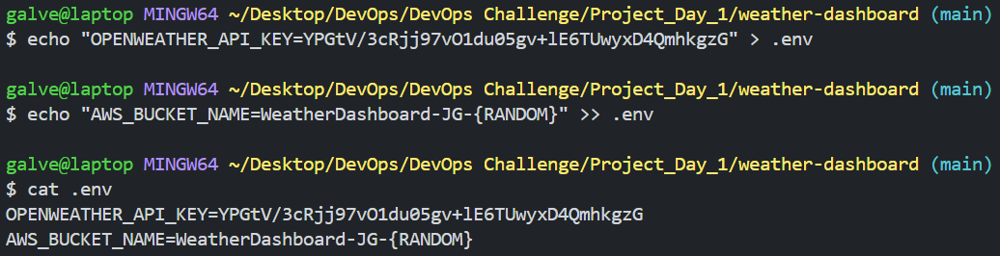

Weather Dashboard Project AWS

WHAT ARE WE BUILDING? This project is about fetching real-time weather data for multiple cities, displaying temperature, humidity,and weather conditions. It automatically stores the data in AWS S3 bucket with timestamps for historical tracking, supporting efficient monitoring across multiple locations.

## PROJECT COMPONENTS:

- Open Weather API: Retrieves weather data for the app.
- AWS S3: Stores weather data securely in the cloud.
- Infrastructure as Code: Automates cloud setup (S3 bucket creation).
- Version Control (Git): Tracks and manages code changes.
- Python Development: Builds app logic using Python.
- Error Handling: Manages issues to keep the app running smoothly.
- Environment Management: Ensures consistent app setup across systems.

Dependencies:

- Boto3: AWS SDK for Python to interact with AWS services (e.g., S3).
- Python-dotenv: Loads environment variables from a .env file.
- Requests: Handles HTTP requests to fetch weather data.

## Folder Structure Of The Project

* src/: Contains the main application code.
* __init__.py: Marks the folder as a Python package.
- weather_dashboard.py: Main script for fetching weather and interacting with AWS.
- tests/: Holds test scripts for the application.
- data/: Stores any data files used or generated by the project.
- .env: Stores sensitive environment variables (e.g., API keys).
- .gitignore: Lists files/folders to exclude from version control.
- requirements.txt: Specifies project dependencies.

---

## Installing Dependencies

Configured my AWS account with access key and assigned a user full access to S3 buckets.

.Env File configuration
This .env file stores sensitive info like API keys securely, separates configurations from code, and makes it easy to manage environment-specific settings.

RUN PYTHON SCRIPT

type python src/weather_dashboard.py to run the application.

Verify AWS S3 Bucket Data= Success :)

Pushing my local code to my GitHub Repository.

What I Learned

AWS S3 bucket creation and management
Environment variable management for secure API keys
Python best practices for API integration
Git workflow for project development
Error handling in distributed systems
Cloud resource management
