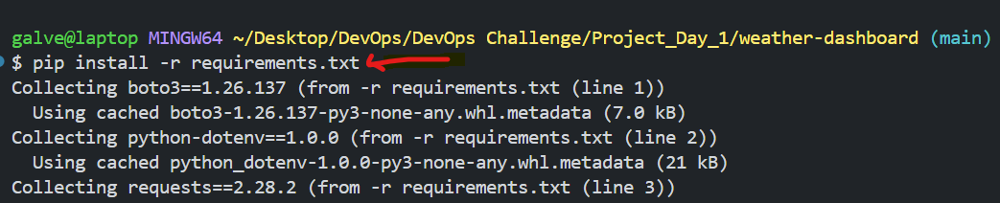
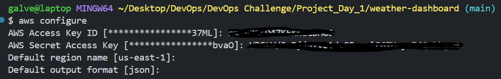
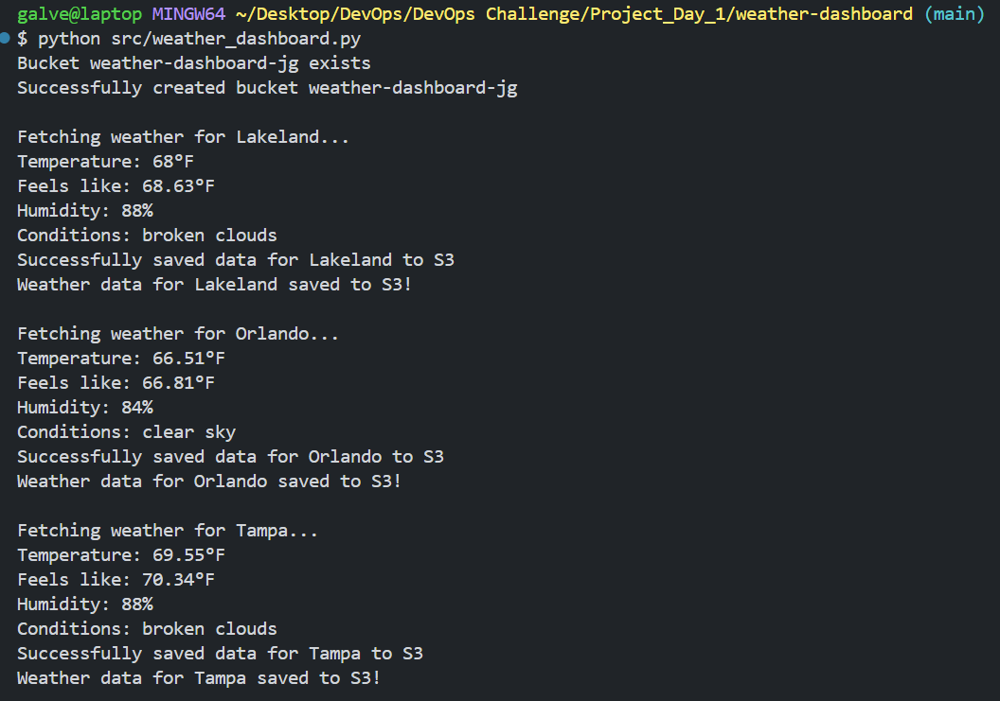
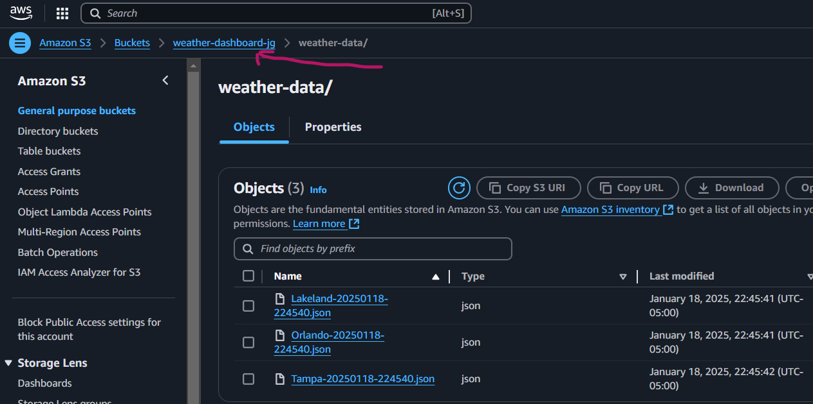

# WEATHER DASHBOARD COLLECTION SYSTEM ON AWS

What are we building? This project is about fetching real-time weather data for multiple cities, displaying temperature, humidity,and weather conditions. It automatically stores the data in AWS S3 bucket with timestamps for historical tracking, supporting efficient monitoring across multiple locations.

## Project Components:

- Open Weather API: Retrieves weather data for the app.
- AWS S3: Stores weather data securely in the cloud.
- Infrastructure as Code: Automates cloud setup (S3 bucket creation).
- Version Control (Git): Tracks and manages code changes.
- Python Development: Builds app logic using Python.
- Error Handling: Manages issues to keep the app running smoothly.
- Environment Management: Ensures consistent app setup across systems.

## Dependencies

- Boto3: AWS SDK for Python to interact with AWS services (e.g., S3).
- Python-dotenv: This will Load environment variables from the .env file.
- Requests: This is to handle HTTP requests to fetch the weather data.
  
## Project Directory Layout
This structure is set up like this to keep everything organized and easy to find, making it simple to work with the code, share it, and test it.

* src/: Contains the main application code.
- __init__.py: Marks the folder as a Python package.
- weather_dashboard.py: Main script for fetching weather and interacting with AWS.
- tests/: Holds test scripts for the application.
- data/: Stores any data files used or generated by the project.
- .env: Stores sensitive environment variables (e.g., API keys).
- .gitignore: Lists files/folders to exclude from version control.
- requirements.txt: Specifies project dependencies.

  

## Installing Dependencies
We are installing the dependencies to ensure the required libraries (boto3, requests,python-dotenv) are available for the script to run correctly. However, I first need to add the dependencies to the requirements.txt file before I run the "pip install" command.
- echo "boto3==12.26.137" >> requirements.txt
- echo "python-dotenv==1.0.0" >> requirements.txt
- echo "requests==2.28.2" >> requirements.txt

Next, I need to configure my AWS credentials to allow secure access to AWS services from my local environment.

Now, we need configure environment variables to store the weather API key secure, and set the name of the S3 bucket. This practice separates configurations from the main code.

  

## Running the Python Script

Here, I am running the script to fetch weather data, process it, and save the results to an AWS S3 bucket.

 

## Now, let's verify if the weather data is in the bucket :)

  

## Pushing Local Code to GitHub Repository
Now I need to push my code from my local development environment to my GitHub repository. Below are the three commands I used, along with a brief explanation of each.
1. git add .: This stages all changes to the code for commit.
2. git commit -m "message": This Commits the staged changes with a message.
3. git push origin main: This pushes local code to my GitHub repository’s main branch.

## What Did I Learn?

- AWS S3 Bucket Creation & Management: I set up and manage cloud storage on AWS to safely store data. 
- Environment Variable Management: I securely handle API keys and sensitive data by using environment variables.
- Python API Integration: I follow best practices for integrating external APIs into my Python project.
- Git Workflow: I use Git to manage version control, and keep my project organized.

## Challenges

- Managing AWS S3 Bucket Naming Constraints: I ran into issues with the naming conventions for AWS S3 buckets, learning that the bucket name must follow strict rules like having all lowercase letters (a-z). It took some time to ensure I was generating valid names dynamically.

- Python Dependencies: I had some hiccups with installing Python dependencies across my environment. I had to carefully configure the requirements.txt and fix any typos to make sure all necessary libraries were installed correctly and without conflicts.

- Script: I encountered an issue with running the script due to Python environment variables not being set up correctly. It took some time to properly configure the PATH variable and ensure the right version of Python was accessible, allowing the script to run.

